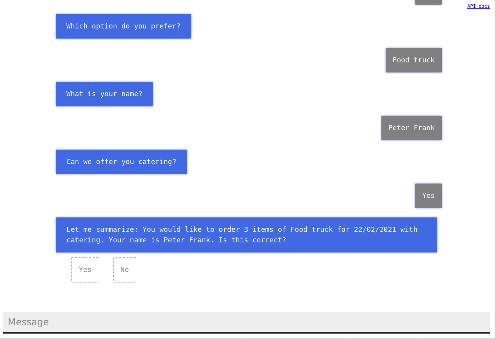

# BotStory

## Intro

This repository contains the BotStory class, an abstract interface to specify storyline branching and entity type schemas for the simple design of natural language chatbot conversation flows. It is based on [ChatterBot](https://github.com/gunthercox/ChatterBot) and [NLTK](https://www.nltk.org).

A demo chatbot is provided in the example folder.
A command line and a [Flask](https://flask.palletsprojects.com/en/1.1.x/) based web interface is also provided. The web interface displays storyline dependent default selections.



## Using Docker

You can build a Docker image and run the application from there:
```
make docker # Build image
make run-docker # Run command line mode
make run-docker-flask # Run web UI
```

During the build of the docker image, necessary requirements are installed, the ChatterBot knowledge graph is trained and the unit tests are executed.

After initiating the Flask app, you should be able to access the web UI at http://localhost:8080/

## Manual setup

### Requirements

Prepare necessary requirements with
```
apt update
apt install python3 python3-pip
make install
```

### Running

Run command line interface with
```
make run
```

Run the web UI with
```
make flask
```
The web application runs on part 8080 by default.

Display other available commands by using
```
make help
```

